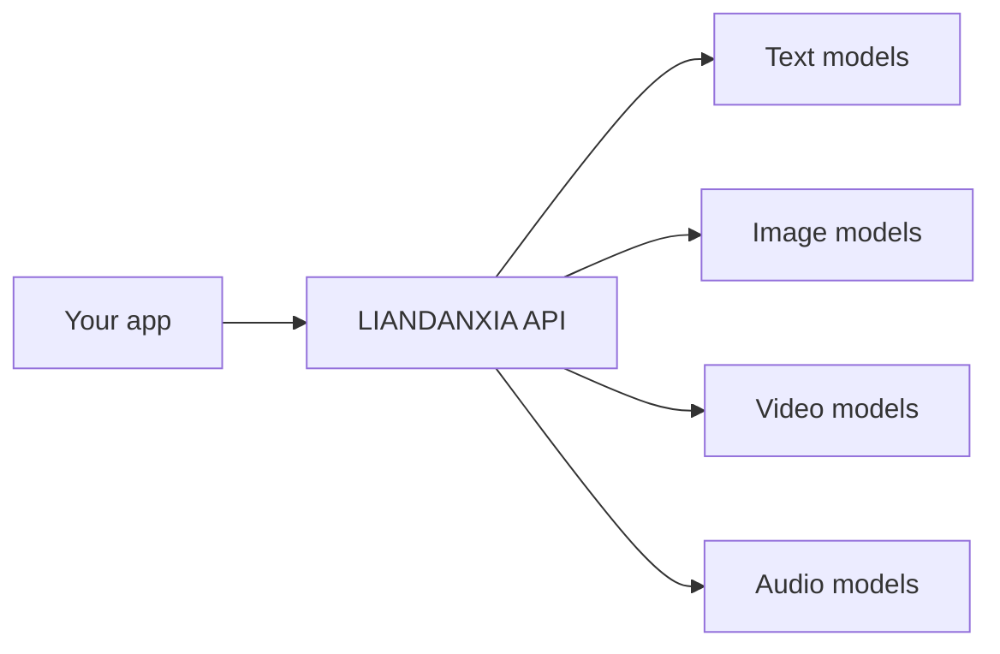

<p align="center">
  
</p>

<p align="center">
  
</p>

<p align="center">
  
</p>

<p align="center">
  <a href="https://liandanxia.io/">
    
  </a>
  <a href="https://docs.liandanxia.io/en">
    
  </a>
  <a href="https://liandanxia.io/models">
    
  </a>
  <a href="https://liandanxia.io/chat">
    
  </a>
</p>

---

## Control Panel

| Signal | Status |
|---|---:|
| Models online | `300+` |
| Providers linked | `60+` |
| API mode | `OpenAI-compatible` |
| Supported worlds | `Text / Image / Video / Audio` |
| Current mission | `Make AI model access feel simple` |

## Choose Your Door

| Door | Destination | Why click it |
|---|---|---|
| Red door | [Website](https://liandanxia.io/) | See the whole platform |
| Blue door | [Docs](https://docs.liandanxia.io/en) | Plug in without wandering |
| Purple door | [Models](https://liandanxia.io/models) | Find the right model fast |
| Green door | [Chat](https://liandanxia.io/chat) | Try the experience directly |

## The Shortcut



## Tiny Spell

```js
const response = await fetch("https://api.liandanxia.io/v1/chat/completions", {
  method: "POST",
  headers: {
    "Authorization": "Bearer YOUR_API_KEY",
    "Content-Type": "application/json"
  },
  body: JSON.stringify({
    model: "your-favorite-model",
    messages: [
      { role: "user", content: "Open the model gateway." }
    ]
  })
});

const data = await response.json();
console.log(data);
```

## Why LIANDANXIA Exists

Most AI apps should not need a different integration path for every provider.

LIANDANXIA gives builders one clean doorway into a large model universe, so they can spend less time wiring providers and more time shipping ideas.

## Loadout

<p>
  
  
  
  
  
</p>

## Transmission Log

```txt
2026-05-26  account created
2026-05-26  profile signal online
next        publish API examples
next        pin useful repositories
```

<p align="center">
  
</p>
